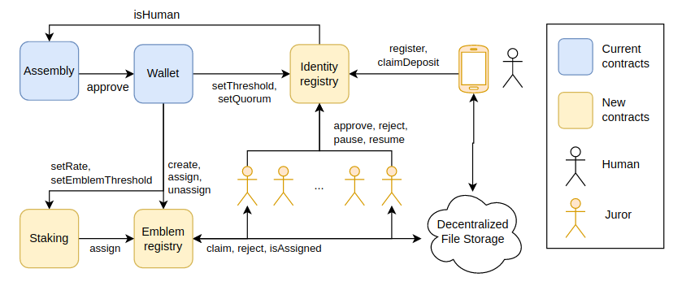

# New Free World's team repository

Hi! We are the [New Free World team](https://new-free-world.org). We created [Humanity Unchained DAO](https://humanityunchained.org). We would like to propose the following roadmap to the community.

We based our proposal on many resources, being [Balaji Srinivasan's new book "The Network State"](https://thenetworkstate.org) one of the best ones available.

---

## Roadmap Proposal

Version 1.0 / 2022-07-21

### Goal

We define the New Free World as the 
Our goal is to accelerate the adveniment of the New Free World by building the first network state. This state uses Humanity Unchainned DAO as a backbone.

We aim to have a DAO of millions of human beings
Before crossing the point of no return towards a technocratic dystopia.

### Organization

Any organization needs some type of structure. We propose to use a special type of NFT for the DAO to assign roles to citizens democratically based on whatever criteria the members of the DAO consider such as, for example, reputation, trustworthiness, merit, professionalism and commitment to the DAO's goal. We call `emblems` to this type of NFT.

The characteristics of `emblems` are:

- Only the DAO can mint, burn and transfer the token.
- Only citizens of the DAO can receive the token.
- The receivers cannot transfer the token to anyone else but they can always refuse it by returning it to the DAO.
- The DAO can take back the token from the holder.

`emblems` can be used to organize the DAO in many ways. To begin with, we propose to mint `emblems` of two types: guilds and projects.

Guilds are groups of citizens who share a common skillset. Projects are groups of citizens who share a common task. For example: project `P` may needs 3 *full-time* citizens of guild `G1`, 2 *full-time* citizens of guild `G2` and 1 *full-time* citizen of guild `G3`.

There is a limited number of tokens per `emblem`, as the DAO decides to mint or burn according to the needs at that time. The DAO shall be cautious in deciding on who assign the tokens to, as each `emblem` carries their corresponding duties and responsibilities.

### Guilds

We propose the following guilds:

|Name|Role and responsibilities|
| --- | --- |
|Mods|They are in charge of the moderation of the social channels, such as Telegram, Twitter, etc. They shall answer questions from the community promptly and accurately.|
|Devs|They are responsible for building and mantaining the tech infrastructure, such as smart contracts, user interface, servers, websites, code repositories, etc. They also play an important role in educating the community in IT security topics.|
|Legals|They are the link between the legacy world and the New Free World.   Example: If the DAO wants to own assets available only in the legacy world (e.g. stock, land, etc.), legals should advise on how to make it happen in the best way possible.|
|Medias|They are responsible for all the official communication channels, such as Odysee, Youtube, podcasts, press, etc.  Example: Medias shall be in charge of communication strategy.|

### Projects

|Name|Goal and description|
| --- | --- |
|[Genesis Tokens](projects/GenesisTokens/README.md)| A way to commemorate the birth of Humanity Unchained DAO by selling a limited number of tokens on an auction. The value of the tokens will be solely honorific and artistic. The funds will be owned by the DAO.  **Important:** It is to be decided by the DAO what kind of reward (if any at all) will the holders of the token receive on exchange in the future. Therefore, token buyers seeking for an investment should expect **nothing** from their purchase apart from the token itself and the community's gratitude.|
|[Emmental](projects/Emmental/README.md)||
|[Identity Registry](projects/IdentityRegistry/README.md)| A better identity registry system than [Proof of Humanity](https://www.proofofhumanity.id) that can better serve for the DAO's goal in terms of governance, scalability and cost |
|[Staking](projects/Staking/README.md)| HUD token holders would receive reputational tokens|

This following diagram represents the system after the tasks are complete:

### Schedule

The following is an orientative schedule. Community Calls will be hold on the Telegram groups. Off-chain voting will be done in snapshot.org.

**Note**: Change on the schedule may be announced on short notice, so stay tune for any updates.

|Event|Details|
| --- | --- |
|Community Call (English)| Friday @ 9PM CET|
|Community Call (Spanish)| Thursday @ 11PM CET|
|Off-chain votings start| Any day|
|Off-chain votings end| Next week's Thursday|
|On-chain voting start| Saturday|
|On-chain voting ends| Monday|

### Other technical improvements

See HUD's tickets here.

## Calendar

**Note**: The following calendar is an **estimate**. We may be forced to change it on short notice because of diverse reasons such as time constrains.

|Milestone|Estimated Date|Status|
| --- | --- | --- |
|Voting for deployment of *multiple-transactions-per-voting* feature | 07-23 Sat | On-schedule |
|Voting for: - NFT tokens minting - PoH oracle update - Technical improvements | 08-05 Sat | On-schedule |
