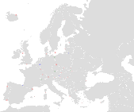

[ [English](README.md) | [Espanol](README_ES.md)]

# Emmental Project

The goal of the **Emmental Project** is to create a geographical concentration of [Humanity Unchained DAO](https://humanityunchained.org) citizens in specific regions of legacy states in order to achieve, through exercising their legal right to move freely within the boards of their legacy states, a political majority in alignment with the principles of the DAO. This idea is inspired by the [Free State Project](https://en.wikipedia.org/wiki/Free_State_Project).

<figure>

 <figcaption>
Example of clusters in Europe. Different colors represent different Networks States or combinations of them.
</figcaption>
</figure>

1. Initial Deposit
2. Phisical moving during the time window
3. Obtain proof of location
4. Claim the deposit back and redeem NFT

